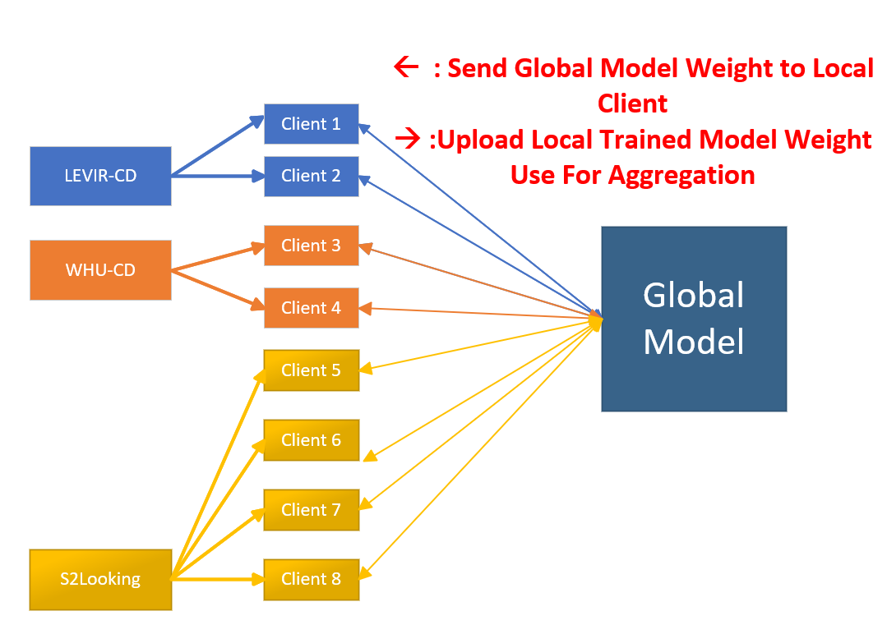

# Fedrated Remote Sensing Change Detection

 

#### 日志
* (2026.1.24) 处理数据集，划分联邦学习数据集
* (2026.1.25) Code Review && 编写一个简单的demo运行
* (2026.1.26) 之前粗略的大致了解了联邦学习和变化检测，这次仔细阅读FedAvg论文，一篇遥感变化检测的论文
* (2026.1.27) 完善日志系统

 

